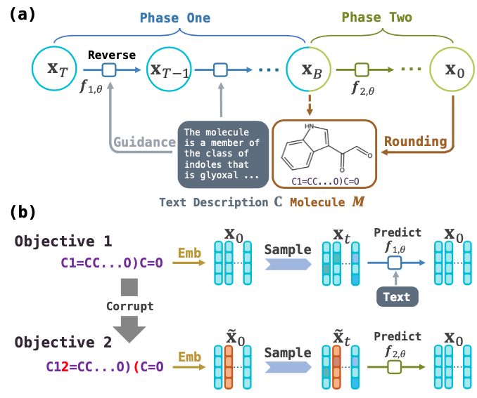

# Text-Guided Molecule Generation with Diffusion Language Model




This is the code for the AAAI 2024 Paper: [Text-Guided Molecule Generation with Diffusion Language Model](https://arxiv.org/abs/2402.13040v1).

## Usage

### Paper data

1. Install Package `cd TGMDLMCODE; pip install -e improved-diffusion/; pip install -e transformers/`.
2. Download [Scibert](https://huggingface.co/allenai/scibert_scivocab_uncased) and put it into file `scibert`.

### Training
1. `cd improved-diffusion; cd scripts`
2. Encode text input `python process_text.py -i train_val_256; python process_text.py -i test`
3. Train model for Phase One: `python train.py`
4. Train model for Phase Two: `python train_correct_withmask.py`

The following details are important for you to know before you actually train this model by yourself!
1) For this model it always needs more than 100,000 steps of training before sampling so you can get a normal result. The perfomance converges long after the convergence of the loss.
2) The loss will finally converges to around 0.015. It is possible that the loss in your experiment will not converge to 0.015 (below 0.02) and stuck at a relative high value (such as 0.08), we suggest you re-run the training procedure with another random seed. Normally, the loss should converge really quickly to below 0.02 within 15,000 steps. If your loss doesn't behave so, just try another time :)    （Thanks to @YHanJG who report this problem）
3) We havn't got any idea why this problem will show up. I did observe once that the loss stuck at a high value, and another researcher reach to me after running my code and report this problem also.  

### Sampling
1. `python text_sample.py; python post_sample.py` The final file `OURMODEL_OUTPUT.txt` is our output.

### Evaluation
you can evaluate all metrics except for Text2Mol by runnning `ev.py`. For Text2Mol please go to [MolT5](https://github.com/blender-nlp/MolT5) for more details.

## Requirements

- python3
- pytorch
- transformers (Be careful to follow the readme installation exactly.)

## Citation

Please cite our paper if you use the code:

```
@article{gong2024text,
  title={Text-Guided Molecule Generation with Diffusion Language Model},
  author={Gong, Haisong and Liu, Qiang and Wu, Shu and Wang, Liang},
  volume={38},
  url={https://ojs.aaai.org/index.php/AAAI/article/view/27761},
  DOI={10.1609/aaai.v38i1.27761},
  number={1},
  journal={Proceedings of the AAAI Conference on Artificial Intelligence},
  year={2024},
  month={Mar.},
  pages={109-117}
}
```

## Acknowledge
This code is based on https://github.com/XiangLi1999/Diffusion-LM and https://github.com/blender-nlp/MolT5
